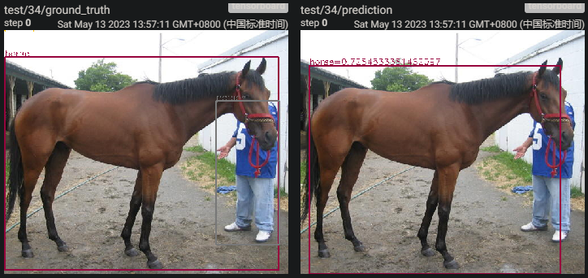

# RetinaNet For Object Detection

## 简介

本仓库是一个用 PyTorch 实现的 RetinaNet 目标检测模型（原论文：[Focal Loss for Dense Object Detection](https://arxiv.org/abs/1708.02002)），使用的数据集为 VOC2012，由于该数据集的测试集没有提供标注，所以我将 trainval 集的 17125 个样本重新按照 8:1:1 的比例重新随机切分为训练集、验证集和测试集；使用 mAP（Mean Average Precision）作为评价指标。

### 实验环境

本次实验代码基于 PyTorch 框架，python 版本为 3.9.16，使用到的 Python 模块及版本如下：

```
albumentations  1.3.0
cv2             4.7.0
matplotlib      3.7.1
numpy           1.24.2
tensorboard     2.12.1
torch           1.13.1
torchvision     0.14.1
tqdm            5.7.1
```

### 项目结构

```
Code1
├─ data                  // 数据集
├─ main.py               // 启动程序
├─ model                 // 预训练权重
├─ output                // 程序输出
├─ prepare_data.ipynb    // 构造数据集
├─ readme.pdf            // 实验报告
└─ src                   // 源代码
   ├─ model              // 模型
   |  ├─ fpn.py          // 特征金字塔网络
   |  ├─ loss.py         // Focal Loss 损失函数
   |  ├─ resnet.py       // ResNet 特征提取网络
   |  ├─ retinanet.py    // RetinaNet
   |  └─ subnet.py       // 分类和回归子网络
   ├─ anchors.py         // 锚框工具
   ├─ datasets.py        // PyTorch 数据集
   ├─ metrics.py         // 评价指标计算
   ├─ tester.py          // 测试
   ├─ trainer.py         // 训练
   └─ visualization.py   // 结果可视化
```

编程实现过程中参考了 [pytorch-retinanet](https://github.com/yhenon/pytorch-retinanet/tree/master) 仓库，其中 `resnet.py` 和 `metrics.py` 在该仓库对应代码上修改得到，其他代码是自己重写的，重写后的代码具有更高的执行速度和可读性。

### 运行

请下载 `VOC2012` 数据集并放到 `./data/VOC2012` 下，使用 `prepare_data.ipynb` 切分并生成数据集列表，然后通过以下命令训练并测试模型（Linux 下也可直接运行 `run.sh`）：

```
python main.py \
    --backbone "ResNet50" \
    --data_path "./data/VOC2012" \
    --input_size 608 \
    --batch_size 16 \
    --eval_batch_size 64 \
    --stage1_total_steps 8000 \
    --stage2_total_steps 4000 \
    --eval_steps 500 \
    --stage1_learning_rate 1e-4 \
    --stage2_learning_rate 1e-5 \
    --output_path "./output"
```

## 方法

### 数据处理

本实验将数据集中 17125 张图像按 8:1:1 的比例随机划分为训练、验证和测试集，使用的预处理方法为标准化并缩放到 $608\times608$，数据增强方法为随机裁剪和水平翻转。

### 模型


<center><strong>图 1  RetinaNet 模型架构</strong></center>

如图 1 所示，RetinaNet 首先使用在 ImageNet 上预训练的 ResNet 提取图像特征，然后再利用 FPN 上采样和融合 ResNet 的特征图，得到多个不同尺寸的特征图。在每个特征图上，生成不同大小（$2^0,2^{1/3},2^{2/3}$）和宽高比（1:2, 1:1, 2:1）的锚框。在不同尺寸的特征图上，这些锚框能够覆盖原图中不同大小的物体。不同的特征图最终会经过相同的分类子网络和回归子网络，得到每个锚框的分类结果和与真实目标框的偏移。

### 损失

这篇论文的主要贡献并不在于模型架构，而是损失函数。它提出的 Focal Loss 会在训练过程中降低置信度较高的分类结果对损失的贡献，从而缓解目标检测任务中的类别不均衡问题。实际上，在最终使用的损失函数中，不仅包含根据置信度调整损失的权重项 $(1-p_t)^\gamma$（$\gamma$ 为超参数，原论文取 2），还包括根据每个类别正负样本比例调整损失的权重项 $\alpha_t$（对于正样本 $\alpha_t=\alpha$；对于负样本 $\alpha_t=1-\alpha$；$\alpha$ 为超参数，原论文取 0.25）。最终损失函数如下：

$$
FL(p_t)=-\alpha_t(1-p_t)^\gamma\log(p_t)
$$

### 训练

由于原论文在 COCO 数据集上的训练需要使用 8 张显卡迭代 9 万步，代价过高，本次实验使用了规模较小的 VOC2012 数据集和单张 A100 显卡。由于本次实验加载了 ResNet 部分的预训练权重，因此使用两阶段训练策略，首先固定 ResNet 部分的权重，训练剩余部分直到收敛；再用较小的学习率微调整个网络。训练时批大小为 8，优化器为 AdamW，学习率线性衰减，两个阶段的初始学习率分别为 1e-4 和 1e-5，训练步数分别为 8000 和 4000，每 500 步进行一次验证并且保留最佳权重。

## 实验结果及分析

### 网络深度对性能的影响


<center><strong>图 2  网络深度对模型性能的影响</strong></center>

如图 2 所示，随着 ResNet 部分网络的深度加深，模型对图像的特征提取能力不断增强，最终性能也不断提升。当使用 ResNet18 时，由于网络层数较少，对图像特征的提取能力较弱，因此效果较差；当 ResNet 网络层数大于 34 时，随着层数增加，模型性能近似线性提升。

### 最终结果

<center><strong>表 1  以 ResNet101 为特征提取器的 RetinaNet 在所有类别上的 AP（降序排列）</strong></center>

|    类别    |  AP  | 在训练集中出现的次数 |
| :--------: | :---: | -------------------- |
|     猫     | 91.04 | 1010                 |
|     狗     | 85.60 | 1301                 |
|    飞机    | 76.70 | 761                  |
|    火车    | 76.49 | 557                  |
|     人     | 74.77 | 13044                |
|     鸟     | 73.82 | 966                  |
|   公交车   | 60.00 | 516                  |
|   摩托车   | 59.11 | 588                  |
|     羊     | 57.08 | 824                  |
|     马     | 54.51 | 619                  |
| 电视遥控器 | 51.11 | 646                  |
|    餐桌    | 50.83 | 617                  |
|    汽车    | 47.85 | 1723                 |
|     牛     | 47.65 | 610                  |
|   自行车   | 44.87 | 639                  |
|     船     | 40.66 | 797                  |
|    沙发    | 34.57 | 652                  |
|    盆栽    | 32.73 | 830                  |
|    瓶子    | 32.63 | 1101                 |
|    椅子    | 31.04 | 2203                 |

如表 1 所示，RetinaNet 对不同类别的检测能力差别较大，并且与该类别在训练集中的出现次数并无太大关联，在训练集中出现第二多的椅子 AP 反而最低，而出现次数最少的火车和公交车 AP 反而较高。推测模型对不同类别的检测能力跟该类别的大小和形态有关，较大的目标（如飞机、火车和公交车等）比较小的目标（如电视遥控器、盆栽、瓶子）更容易检测；同种类别形态大致相同的目标（如猫、狗和人等）比形态多样的目标（如沙发、盆栽和椅子等）更容易检测。




<center><strong>图 2  测试集部分图像检测结果，每两张图左边为真实标签，右边为检测结果</strong></center>

如图 2 所示，过小的远处物体和被遮挡的物体更难被检测。
